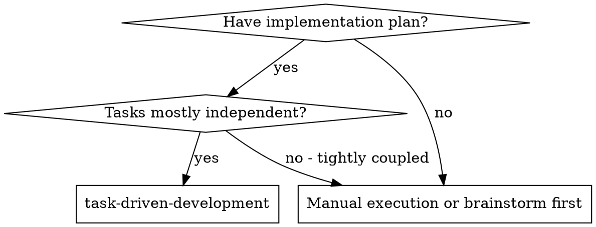
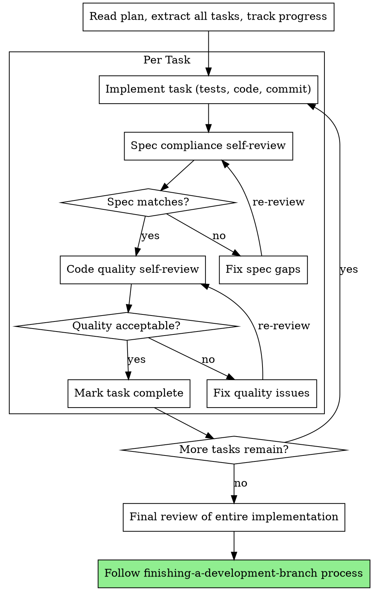

# Task-Driven Development

Execute plan by working through one task at a time, with two-stage review after each: spec compliance review first, then code quality review.

**Core principle:** One task at a time + two-stage review (spec then quality) = high quality, fast iteration

## When to Use

## The Process

## Context Isolation

Even though you're working sequentially in one session, apply context isolation principles:
- Give each task only the relevant file context it needs
- Don't let decisions from earlier tasks bleed into later ones without justification
- Keep each task focused on its defined scope

## Two-Stage Review

After completing each task, run two sequential reviews:

**Stage 1 — Spec Compliance:**
- Does the code match the spec exactly?
- Nothing missing? Nothing extra?
- If issues found → fix → re-review

**Stage 2 — Code Quality:**
- Clean architecture?
- Good test coverage?
- No magic numbers, proper naming?
- If issues found → fix → re-review

**Start code quality review ONLY after spec compliance passes.**

## Task Status Protocol

Track each task with one of four statuses:

**DONE:** Proceed to spec compliance review.

**DONE_WITH_CONCERNS:** You completed the work but have doubts. Note concerns, address if about correctness/scope, then proceed to review.

**NEEDS_CONTEXT:** You need more information. Stop and gather what's needed before continuing.

**BLOCKED:** Cannot complete the task. Assess:
1. Missing context → gather it
2. Task too large → break into smaller pieces
3. Plan itself is wrong → escalate to the human

**Never** force through a blocker. If you're stuck, something needs to change.

## Red Flags

**Never:**
- Start implementation on main/master branch without explicit user consent
- Skip reviews (spec compliance OR code quality)
- Proceed with unfixed issues
- Accept "close enough" on spec compliance
- Skip review loops (issues found = fix = review again)
- **Start code quality review before spec compliance is done** (wrong order)
- Move to next task while review has open issues

## Integration

**Required workflow skills:**
- **using-git-worktrees** - REQUIRED: Set up isolated workspace before starting
- **writing-plans** - Creates the plan this skill executes
- **requesting-code-review** - Code review template
- **finishing-a-development-branch** - Complete development after all tasks
- **test-driven-development** - Follow TDD for each task
